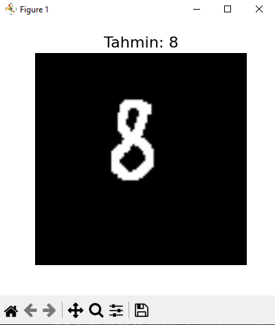

# MNIST Digit Classifier

A simple CNN-based digit recognizer trained on the MNIST dataset.

## Files
- `main.py`: Model training with data augmentation
- `pred.py`: Predict custom hand-drawn digits (PNG)
- `model.keras`: Saved model
- `pixil-frame-0.png`: Sample input image

## Example Prediction



## Usage

```bash
python main.py
python pred.py
```

> Place your 28x28 PNG digit as `pixil-frame-0.png`

## Requirements
- tensorflow
- opencv-python
- matplotlib
- numpy

## License
MIT
